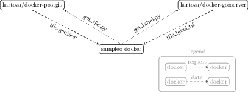

# Sampleo

An open, modifyable and dockerized module to sample raster-label pairs for Earth Observation data.



This repository builds a `sampleo` docker container that executes queries to
a PostgreSQL/PostGIS server and Geoserver to sample rectangular tiles (`get_tile.py`) and
label raster images (`get_label.py`) from a defined region.

## Minimal Working Example

### Environment Variables for Configuration

Necessary environment variables stored in `auth/environment.env`:
```
export PG_PORT=25432
export PGPASSWORD=changeme
export PG_DATABASE=geo
export PG_USER=postgres
export PG_HOST=localhost

export WMS_HOST=localhost
export WMS_USER=""
export WMS_PASSWORD=""
```

### Create a PostGIS and Geoserver from `kartoza` docker images


pull and launch PostgreSQL/PostGIS local server and Geoserver from [kartoza docker images](https://github.com/kartoza/docker-postgis)
```
bash deploy.sh
```

#### PostgreSQL/PostGIS

Install the `randompointsinpolygon` SQL function on the PostGIS server
```
psql -d $PG_DATABASE \
 	-U $PG_USER \
	-p $PG_PORT \
	-h $PG_HOST \
	-f sql/randompointsinpolygon.sql
```

insert a demo AOI into the new table `demoaoi`
```
psql -d $PG_DATABASE \
  -U $PG_USER \
  -p $PG_PORT \
  -h $PG_HOST \
  -f data/create_demoaoi_table_and_insert_rectangle.sql
```

single feature in `demoaoi` table inserted by the sql above


#### Geoserver

geoserver configuration at `http://localhost:8080/geoserver`
user: `admin`, password: `geoserver`

Demo shapefile located at `data/geoserver/data/osm_buildings.shp`
and wms configured in `data/geoserver`

Demo shape dataset:


## Get Tile
Randomly samples a rectangular tile defined by the `--sql` statement.
Stores it as `geojson` in `--outfolder`.
The size can be defined by `--tilesize` in meter.

```
python get_tile.py \
  --sql "from demoaoi" \
  --tilesize 240 \
  --outfolder data/geojson
```


## Get Label

Reads the `tile.geojson` file and queries the WMS server for a raster image.
The WMS configuration is preconfigured in data/geoserver for this demo.

Query a label from the WMS server defined by a geojson
```
  python get_label.py \
    --outfolder data/tiff \
    --layer osm_buildings \
    data/demo/tile.geojson
```


## Get Raster (not implemented yet)

Reads the `tile.geojson` and queries a `WCS` service to retrieve raster data.

## Authors

[Marc Rußwurm](http://www.lmf.bgu.tum.de/russwurm/), Technical University of Munich, Chair of Remote Sensing Technology

[Alejandro Coca](), King's Colledge London,
