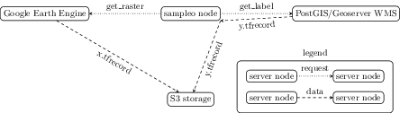

# Sampleo

A dockerized module to sample raster-label pairs for Earth Observation data



**important**: these scripts require the environment variables `PG_HOST`, `PG_PORT`,`PG_USER`, `PG_DATABASE`, `PG_PASS` to be set for the PostgreSQL/Postgis connection.
These environment variables can be passed via `--env-file auth/environment.env` to the docker image.


## Start local PostgreSQL/PostGIS and Geoserver

Necessary environment variables stored in `auth/environment.env`:
```
export PG_PORT=25432
export PG_PASS=changeme
export PG_DATABASE=geo
export PG_USER=postgres
export PG_HOST=localhost
```

pull and launch PostgreSQL/PostGIS local server and Geoserver from [kartoza docker images](https://github.com/kartoza/docker-postgis)
```
bash deploy.sh
```

show running docker images
```
$ docker ps
CONTAINER ID        IMAGE               COMMAND                  CREATED             STATUS              PORTS                     NAMES
0263019c9191        kartoza/geoserver   "catalina.sh run"        7 seconds ago       Up 6 seconds        0.0.0.0:8080->8080/tcp    geoserver
013972c26315        kartoza/postgis     "/bin/sh -c /docker-…"   46 seconds ago      Up 45 seconds       0.0.0.0:25432->5432/tcp   postgis
```

insert a demo AOI into the new table `demoaoi`
```
psql -d $PG_DATABASE -U $PG_USER -p $PG_PORT -h $PG_HOST -f data/create_demoaoi_table_and_insert_rectangle.sql
```

single feature in `demoaoi` table inserted by the sql above


## Get Tile
create a `geojson` in `--outfolder` that describes a rectangle of size `--tilesize` in meter.
The rectangle is located randomly within the geometry defined by `--sql`
```
python get_tile.py --sql "from demoaoi" --tilesize 240 --outfolder data/geojson
```

<src width=75% img=doc/tiles.gif>


## Query munich

make sure that auth/google-service-account-key.geojson is present
```
docker run -v $HOME/.config/earthengine:/root/.config/earthengine -v $PWD/auth:/auth --env-file auth/credentials.env sampleo bash get_munich.sh
```

clone repository
```
git clone https://gitlab.com/MarcCoru/sampleo.git
```

build docker image
```
bash build_docker.sh
```

authenticate earthengine
```
docker run -ti -v $HOME/.config/earthengine:/root/.config/earthengine sampleo
root@c98349e14a4d:/sampleo# earthengine authenticate
```

main script:
```
docker run -v $PWD/auth:/auth --env-file auth/credentials.env sampleo \
  bash get.sh
```

run tests from the docker image
```
docker run --env-file credentials.env sampleo \
  bash selftest.sh
```
## Structure

the main script `get.sh` calls python scripts
  1. to generate a tile-geojson (`get_tile.py`)
  2. to query labels form a `WMS Server` (`get_label.py`)
  3. (tbd) to query raster data from `Google Earth Engine` (`get_raster.py`)
  4. (tbd) to load everything on Google Cloud storage

### Get Tile

Requires the `RandomPointsInPolygon.sql` SQL function.
The code is stored in `./sql`.
It needs to be executed once on the PostGIS server to register the function.

query a tile from the grid cells that are attributed with
```
docker run --env-file credentials.env sampleo \
  python get_tile.py --sql "from grid where origin='bavaria' and train=true"
```

writes geojson representation to output folder (default `data`).
naming format: `"E{e}N{n}UTM{zone}{row}"` e.g, `E557000N5569100UTM32U`
e.g., geojson output: `data/E557000N5569100UTM32U.geojson`

### Get Label

reads a geojson tile representation and queries a `Geotiff` from a defined WMS Server

requires environment variables `WMS_HOST`, `WMS_USER` and `WMS_PASS`

```
docker run --env-file credentials.env sampleo \
  python get_label.py `data/E557000N5569100UTM32U.geojson`
```

## Tools

Functions and scripts meant to be run once for initial setup.

### Create Grid

Builds a SQL query to create a rectangular grid within a `--geometry` at `--table` of given `--height` and `--width`.
A `--margin` can be specified between the grid cells.
Each grid cell is attributed by a boolean `eval` at `--eval_ratio` and grid cells that are not `eval` are attributed by a boolean `train` at --train_ratio``


the `--geometry` table requires `geom::geometry, native_srs::integer, name::test` fields.
The generated `--table` contains `id::serial`, `origin::test`, `eval::bool`, `train::bool`

Example call (query is written to `query.sql`):
```bash
python create_grid.py \
    --geometry "from regions where name='bavaria'" \
    --table "dev.testgrid" \
    --width 3000 \
    --height 3000 \
    --margin 500 \
    --eval_ratio 0.8 \
    --train_ratio 0.5 > query.sql
```

`query.sql` can be executed via `psql`
```bash
psql -d $PG_DATABASE -U $PG_USER -h $PG_HOST -p $PG_PORT -f query.sql
```

### Convert Tif to Tfrecord

```
python tif2tfrecord.py <tiffolder> <target>.tfrecord
```

raster images are organized in `<tiffolder>/x/*.tif` and label image(s) in `<tiffolder>/y/*.tif`.
the output `<target>` will be `gzipped` if it ends with `.gz`

## Quicktests

check google connectivity
```
docker run -v $PWD/auth:/auth --env-file auth/credentials.env sampleo bash google_init.sh /auth/google-service-account-key.json
```

## Notes

```
docker run -v $HOME/.config/earthengine:/root/.config/earthengine -v $PWD/auth:/auth --env-file auth/credentials.env sampleo bash get_tif.sh
```
